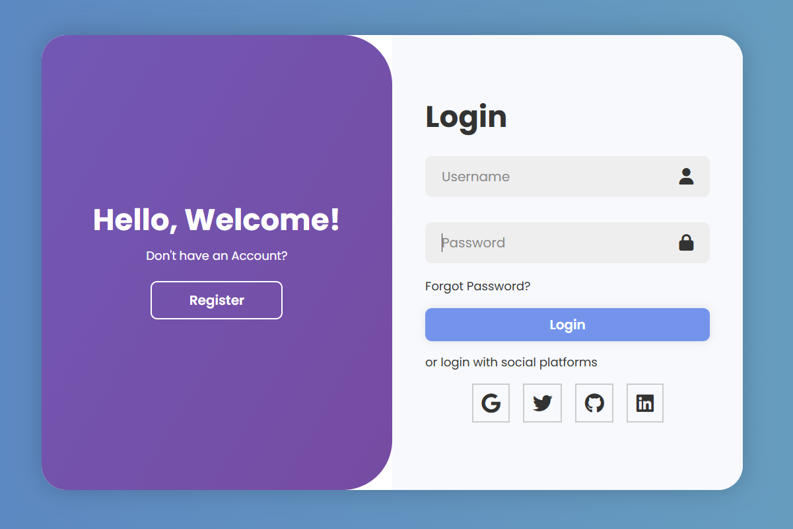
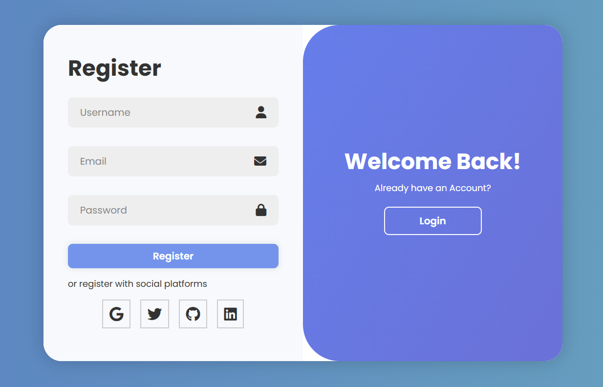

# 🔐 Login/Signup Page with Firebase Realtime DB + FormSubmit

<div align="center">
  
</div><br>

<div align="center">
  
</div>

<p align="center">
  🚀 Sleek, animated authentication system powered by Firebase Realtime Database & FormSubmit. Fully responsive, no backend, just frontend magic ✨
</p>
<!---
<p align="center">
  <a href="https://github.com/yourusername/your-repo-name"></a>
  <a href="#"></a>
</p>--->

---

## 🧠 Overview

**Login/Signup UI** with a glowing, animated terminal-inspired style that :

- Stores user credentials in **Firebase Realtime Database**
- Sends registration details to your inbox via **FormSubmit**
- Uses **Vanilla HTML, CSS, and JavaScript** — 100% frontend
- Includes dynamic toggling between login & signup panels

---

## 🎮 Live Demo

🔗 **[Try the Live Project Here](https://login-portal-auth.vercel.app/)**


---

## 📦 Features

| 🔧 Feature             | 💬 Description                                                                 |
|------------------------|-------------------------------------------------------------------------------|
| ✅ Firebase Integration | Saves username, email & password to Realtime Database                        |
| ✉️ Email Notifications | Sends form data to your inbox using [FormSubmit](https://formsubmit.co)      |
| 🎭 Sliding Panel UI    | Interactive toggle animation between Login ↔ Signup                           |
| 🧊 Social Icons        | Integrated Font Awesome icons for visual appeal                               |
| 🎨 Responsive Design   | Mobile-first, smooth on all devices                                            |
| 🚀 Easy Deploy         | 100% frontend — hostable on Netlify, Vercel, or GitHub Pages                  |

---
## 💻 Tech Stack

- **HTML5** — structure
- **CSS3** — animations & responsive styling
- **JavaScript (ES6)** — form logic
- **Firebase** — Realtime Database connection
- **FormSubmit** — serverless email sending
- **Font Awesome** — for icons

---
## ⚙️ How to Run

Clone the repo
```bash
git clone [https://github.com/bhoomi155/firebase-auth-ui.git](https://github.com/bhoomi155/firebase-auth-ui.git)
cd firebase-auth-ui
```

---

## 🧪 Test It

- ✅ Fill out the registration form
- 📤 It saves the data to **Firebase Realtime Database**
- 📩 You'll receive an email via **FormSubmit**
- 🔐 Try logging in with the same username & password
- 🧯 Alerts will show success or failure based on input

---

## 🚧 Future Enhancements

| Feature             | Status      |
|---------------------|-------------|
| 🔐 Firebase Auth    | 🔜 Planned  |
| 🧾 Forgot Password  | 🔜 In Queue |
| 📬 Welcome Email    | 🔜 Optional |
| 🖥️ User Dashboard  | 🔜 Future   |
| 📊 Input Validation | ✅ Done     |

---

## 📜 License !!

This project is licensed under the **MIT License**.

You are free to use, modify, and share this code — just give proper credit 💖  
See the [LICENSE](LICENSE) file for full license text.

---

## 💬 Feedback?

Got a suggestion, bug, or feature request?  
Feel free to [open an issue](https://github.com/bhoomi155/firebase-auth-ui/issues) or [start a discussion](https://github.com/bhoomi155/firebase-auth-ui/discussions).

You can also connect with me here:
- GitHub: [@bhoomi155](https://github.com/bhoomi155)

Pull requests are always welcome 🙌
---
